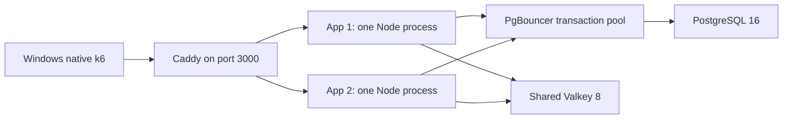

# Performance discrepancy investigation — 2026-10-01

This is a fresh assessment of current source, configuration and saved measurements.
No application code, pool size, cache TTL, Docker configuration or business data was
changed. No k6 scenario, bulk token generation, service restart or deployment was
performed. The offline analyzer is `scripts/analyze-performance-evidence.mjs`; its
sanitized output is `docs/performance-discrepancy-evidence.json`.

## Conclusion and confidence

The fast suite and the slow captures are **not verified as the same environment**.
The strongest discovered difference is their request path: all 16 fast-suite
summaries lack Caddy's timing metrics, whereas the slow captures contain them.
Both use the same URL, role and reported token count. A shared URL does not
identify the process listening on its port.

The slow captures establish app event-loop overload and app-side pool queueing;
they do not establish PostgreSQL connection exhaustion. The likely explanation is
different serving topology/execution environment, compounded by profiling and
resource competition. The exact historical listener and causal contribution of
each difference remain unverified. Do not report this hypothesis as a proven root
cause or claim that the production target has been reached.

The user does not remember which process served the fast suite. No listener/PID,
image IDs, resolved runtime configuration or resource capture was recorded with
those results. Docker Desktop's Linux engine was unavailable during this review,
including the approved retry outside the original sandbox. Live SQL, Redis,
container limits, cgroup throttling and controlled HTTP comparisons could not be
measured. Starting/rebuilding services would create a new environment rather than
recover the historical one, so it was not done.

## Timeline: the fast results are newer

The supplied prompt includes 14 results from a saved 16-test suite; the other two
are the 1,000- and 1,200-VU long-load tests. Exact matches were found under
`test-results/2026-09-30T22-17-48-530Z/`.

| Saved run | Time in Asia/Karachi | VUs / workload | HTTP p95 / p99 | Whole-run req/s | HTTP failures |
| --- | --- | --- | --- | ---: | ---: |
| Diagnostic 18:23 UTC | Sept 30, 23:23 | 2,000 / load, 5m hold | 3.69s / 6.27s | 742.62 | 198 |
| Diagnostic 19:02 UTC | Oct 1, 00:02 | 1,000 / load, 5m hold | 788ms / 1.44s | 547.83 | 0 |
| Diagnostic 21:19 UTC | Oct 1, 02:19 | 2,000 / load, 5m hold | 1.80s / 3.50s | 920.42 | 0 |
| Diagnostic 21:34 UTC | Oct 1, 02:34 | 2,000 / load, 5m hold | 3.90s / 6.84s | 703.75 | 0 |
| Fast suite, 1,000 load | Oct 1, 03:17 | 1,000 / load, 5m hold | 13.39ms / 37.57ms | 648.87 | 0 |
| Fast suite, 2,000 load | Oct 1, 06:37 | 2,000 / load, 5m hold | 30.36ms / 64.17ms | 1,290.73 | 0 |
| Fast suite, 2,000 long load | Oct 1, 06:46 | 2,000 / load, 30m hold | 33.65ms / 72.22ms | 1,593.92 | 0 |
| Fast suite, 2,000 stress | Oct 1, 07:20 | 2,000 / dashboard, 5m peak | 432.79ms / 2.55s | 1,116.07 | 0 |

The diagnostic rows are directly supported by their `run.json`, `preparation.txt`
and `k6-result.txt`, not by older context summaries. The 21:19 capture has a
11.68-GiB Docker memory denominator; the 21:34 capture has 7.756 GiB. The prompt
identifies their CPU budgets as six and four cores respectively; the saved
captures do not independently record Docker's CPU count. Memory denominators are
VM/container-visible limits, not proof of dedicated per-service reservations.

## Architecture and request flow

Configured Docker path:



App 2 is a replica of the same application, not a separate business service.
Dockerfile pins Node 24.21.0; package.json pins Next 16.3.2. Each app runs
`scripts/standalone-server.cjs`, with Next's normal handler and a direct dispatch
lane for 11 guarded JSON GET routes. App pages, SSR, writes and other routes use
Next's normal pipeline. `HOT_PATH_LANE=0` disables the lane;
`HOT_PATH_JSON_BODY=0` restores stream conversion for cached responses.

The native alternative is built into `npm start`: `scripts/start-local.mjs`
starts Docker PostgreSQL/PgBouncer/Valkey, then starts a **Windows Node server**
directly and a Windows email worker. It does not start the two app replicas or
Caddy as part of that command. `docker-compose.direct-app.yml` provides another
alternative that publishes one Docker app directly. Either can make the same
loopback URL refer to a materially different request path. These are available
paths, not proof that either served the fast suite.

For tested staff/student requests, API policy strips untrusted session headers
and applies transport policy; RBAC verifies the signed session, account validity,
student enrichment where applicable, role and tenant/graduate rules. Dashboards
use short-lived aggregate read caches. Staff timetable uses a 600-second cache;
student timetable additionally queries current membership on every request.
Both profile handlers query current data on every request. Load's secondary
request is profile, not its richer `include=catalog`/`campuses=1` variant.

Shared Valkey coordinates fills/refreshes across replicas. Each process also has
its own verified-token memo, account-validity memo, tracked read cache and
single-flight map. The tracked cache holds up to 8,192 eligible entries, subject
to a separate string budget and expiry. Dashboard base TTL is 45 seconds, with
store jitter; local values never outlive their bounded Redis-derived expiry.
Refresh concurrency and its DB client pool are each four per process. Profile,
ownership and student membership were not changed to cached authorization.

Parent/institution guarded routes and applicant SSR exist but are not exercised
by MIXED. Parent linked-child checks and applicant session/ownership checks are
separate flows. These read-only benchmarks do not certify writes, login,
payments, exports, parent or applicant production traffic.

## Configuration differences that matter

| Factor | Fast suite | Slow diagnostic captures / current configuration |
| --- | --- | --- |
| URL | Recorded `http://127.0.0.1:3000` | Same, verified in preparation records |
| Role / accounts | MIXED / 2,500 recorded | Same, verified in preparation records |
| Inventory now | 1,500 student, 1,000 staff, 1 institution | MIXED excludes institution; credentials not printed |
| Generator | Native Windows k6 | Native Windows k6; not a Docker-generator discrepancy for these runs |
| Actual port owner | Not recorded | Caddy timing header present; both app traces present |
| Proxy timing metrics | Absent from all 16 summaries | Present |
| Node profiling | No profiler recorded; k6 diagnostic trends absent | Both processes continuously CPU-profiled, operation histograms and slow-request logs enabled |
| App processes / image | Not recorded | Two app traces; image at preceding checkpoint `c9f0fe1d...`; per-run image IDs absent |
| App client pools | Unknown runtime | Docker k6 overlay: foreground 15 + refresh 4 + readiness 1 per app |
| Native app configuration | Unknown runtime | Current `.env`: foreground pool 10; loopback PgBouncer/Redis URLs |
| PostgreSQL backend budget | Not recorded | Compose: max_connections 100; PgBouncer 25 +5 reserve per applicable pool |
| Heap vs memory | Not recorded | App heap flag 1,024 MB; no explicit per-service CPU/memory limits found in Compose |
| Database / cache state | No snapshot; tests sequential | Separate captures, profiling setup; database state not compared at fast-suite times |

Current Compose PostgreSQL settings include shared_buffers=1536MB,
effective_cache_size=4GB, work_mem=16MB and maintenance_work_mem=256MB. Valkey is
configured for 260 MB with allkeys-lru and no snapshot saves. Caddy uses least_conn,
compression, keepalive reuse, readiness probes and GET-only retry matching.
Source configuration is not evidence these exact values ran during the fast suite.
Comments about planner behavior in Compose are historical explanations, not
measured evidence for this discrepancy.

Two app processes can create up to **40** configured pg client connections in
total (30 foreground, eight refresh, two readiness). Background workers and
admin clients can add connections. PgBouncer transaction pooling means this is
not 40 permanently dedicated PostgreSQL backends. The DATABASE_URL query string
`connection_limit=1` does not supersede pg's explicit `max` setting; pg-pool is
configured in `src/db/index.ts`, not Prisma.

The serialized-response source and load/spike/stress scripts match their Sept 30
18:15 checkpoint hashes. The preloader does not match its recorded hash. There
is no usable Git baseline, and source hashes do not prove historical deployed
image identity. The suite does not persist script hashes or inherited
`THINK_SEC`, `INCLUDE_UNREAD`, Node flags or Docker environment values.

## Workload verification and interpretation

`scripts/run-test-suite.mjs` uses the same `k6/run.mjs` and scenario files as the
diagnostic collector. Load uses a one-minute ramp to 20%, two-minute ramp to peak,
five- or thirty-minute hold and one-minute ramp down. Each iteration randomly
selects a student/staff token, reads dashboard, timetable every fifth iteration,
profile every eleventh, and sleeps 1.5 seconds by default. Optional unread requests
are off unless enabled. Random selection means VUs are not unique simultaneous
accounts; 60% of the inventory is student and 40% staff.

Stress sleeps 0.5 seconds and requests dashboards only. Spike sleeps 0.3 seconds
and requests dashboards only, with a ten-second peak ramp and one-minute hold.
At 2,000 peak VUs those defaults offer approximately 4,000 and 6,667 dashboard
iterations/second before response time adds pacing. They are substantially harder
than load. Their increasing tail latency is consistent with a capacity boundary,
even in the fast environment. It does not invalidate the fast sustained results.

Important correction to earlier context: **this specific fast suite already has
the five-minute stress peak hold**. Its 2,000 stress result spans approximately
20 minutes. Comparing it to an older no-hold stress script would be incorrect.

Fast load throughput is close to its pacing ceiling. Ignoring initial-iteration
effects and request time, the nine-minute 1,000-VU scenario averages about 650
req/s; it reports 648.87. The equivalent 2,000-VU scenario predicts about 1,300
req/s and reports 1,290.73. A thirty-minute hold changes the ramp contribution:
about 1,610 req/s predicted versus 1,593.92 recorded at 2,000 VUs. Thus increased
whole-run throughput in long load is mostly expected from more time at peak,
not evidence that capacity itself improved during the long test.

Saved request/check counts and iteration durations are consistent with the
scripted workload. However, checks assert HTTP 200, not complete response-schema
or account/tenant-specific correctness; body-equivalence checks remain necessary
before certifying the faster environment. Zero-duration minimum samples are not
alone evidence of fabricated measurements.

## What the slow traces establish

The 21:34 2,000-VU capture matches the prompt's 4-core/8-GB metrics exactly:
pool-wait median 2,067ms/p95 4,209ms; query median 25.8ms/p95 180ms; HTTP
p95 3.90s/p99 6.84s. The 21:19 capture matches the larger-budget metrics.

* Both app foreground pools reach total 15, idle zero, with hundreds queued.
  Across the whole 21:34 trace, queue maxima are 299 and 339.
* All 55 PgBouncer snapshots in each of those two captures report cl_waiting=0.
  Maximum sampled active server counts are 17 and 13, below the configured 25
  normal budget. These are ten-second samples and cannot rule out shorter spikes.
* At peak, median event-loop utilization is approximately 1.0 on both apps.
  Median interval loop p95 is about 287–295ms at the smaller budget and
  246–249ms at the larger budget. Whole-run loop maxima at the smaller budget
  reach 895ms and 915ms. CPU percent below 100% does not imply an available loop:
  VM/host scheduling can prevent a runnable Node thread receiving a full core.
* Peak client-side query mean is approximately 163–165ms at the smaller budget,
  while PgBouncer's median interval-average query time is about 24.6ms. Those
  are different populations/statistics, but the large gap supports delayed
  result handling in the client. PostgreSQL can finish and return its backend
  to PgBouncer before the app processes the result and releases its pg client.
* pg-pool releases `pool.query` clients inside the query completion callback.
  A blocked/descheduled event loop delays that release and the pool queue,
  independently of PostgreSQL max_connections. Cache expirations can then
  introduce more foreground work. This mechanism fits the traces; its exact
  contribution requires release/hold instrumentation and a controlled comparison.
* Saved snapshots show many idle PostgreSQL backends and no deadlock/temp-byte
  increase in the sampled run. App RSS peaks around 350MiB each. These samples
  provide no evidence of app heap exhaustion or PostgreSQL connection exhaustion.
* Caddy consumes a material share of CPU (whole-run sample median about 86% of
  one core at the smaller budget). Removing it could change both overhead and
  CPU available to apps/database. This remains an experiment, not a production
  recommendation to remove the proxy.
* Both replicas are affected similarly; this is not the older app2-only routing
  failure recorded in context. Background pools do not show the same large queue.

CPU samples include HTTP writes, request construction and diagnostic work; GC
accounts for about 2.7% of sample time. The preloader itself has about 4.6–4.8%
self sample weight. Roughly 36% of stacks include the diagnostic wrapper, but
that includes ordinary application work beneath it and **must not be described
as 36% profiling overhead**. Continuous profiling, timing headers, histogram
updates, slow-request JSONL writes and frequent Docker/SQL sampling introduce
unquantified overhead. An instrumentation-on/off control is necessary.

Per-request phase headers sum measured operations. Parallel operations can
overlap; background refresh inherits request async context and can add phase
measurements before/after headers are committed. Coalesced requests can wait
without owning the measured SQL operation. Header trends contain only responses
with the relevant header; interval histograms include other measured operations.
Therefore phase percentiles cannot be added, used as literal isolated SQL
execution time, or compared without population caveats. Extreme Redis phase
sums above request duration are not evidence of single Redis commands taking
minutes. PgBouncer's query timing is also distinct from PostgreSQL execution-only
timing.

## Ranked plan: establish causality before runtime changes

| Rank | Action | Expected impact / reason | Evidence required before implementing a runtime optimization |
| ---: | --- | --- | --- |
| 1 | Identify port owner, proxy header, process count, build/image hashes, env and VM limits for each run | Highest diagnostic value; avoids optimizing a different deployment | Snapshot before and after each controlled test |
| 2 | Compare ordinary two-app Caddy stack with diagnostics off, then on, then off again | Quantifies observer overhead and detects drift | Same image, accounts, script, role, pacing, cache preparation and hold; matched event-loop/pool/resource data |
| 3 | Compare Windows native, direct Docker app, and two-app Caddy paths under the same read workload | Tests the strongest topology hypothesis | Distinct ports and confirmed listeners; fixed database/Redis fixture; per-phase throughput and equivalent bodies |
| 4 | Measure pg acquire-to-release hold time, query completion and cache hit/miss/refresh demand | Distinguishes delayed client release, misses and genuine DB pressure | Low-overhead aggregate counters; no JWT/SQL/value logging; do not extend ownership/authorization TTLs |
| 5 | If scheduling dominates, reduce measured HTTP/proxy/diagnostic work or contention | Could reduce both event-loop delay and secondary pool queueing | CPU profile plus controlled before/after; preserve security, proxy behavior and response contract |
| 6 | If cache misses dominate, fix demonstrated refresh/residency/invalidation bottleneck | Avoids unnecessary SQL while retaining freshness | Measured per-replica working set and miss cause; fixture correctness checks |
| 7 | Tune DB/client pool or SQL only if the corresponding component actually saturates | Prevents moving the queue to PostgreSQL or increasing contention | Sustained backend demand, measured hold time/queries/waits; increase neither limit by guesswork |

Current measurements do not justify a business-logic rewrite, larger PostgreSQL
max_connections, larger app pools, extra replicas, more Redis or additional RAM.
The smaller native `.env` pool being available alongside fast results is an
additional reason not to treat larger pools as the default cure.

## Controlled test protocol and remaining work

1. Once Docker is available, capture `docker info`, container image IDs/commands,
   restart/OOM state, effective *non-secret* environment, cgroup cpu.stat/memory
   events, Caddy's loaded configuration and the Windows port-3000 owning process.
   Capture both the native build ID and Docker build ID if comparing platforms.
   Do not dump full environment or unredacted Compose config.
2. Use ordinary Compose + k6 overlay for the initial two-replica baseline, without
   the diagnostic override. Confirm Caddy's timing header exists and both
   replicas receive traffic. Record the actual listener rather than trusting URL.
3. Fix MIXED, the same 2,500-token file fingerprint, load script fingerprint,
   THINK_SEC=1.5, INCLUDE_UNREAD=false, TARGET_VUS=2000 and DURATION=5m. Do not
   regenerate tokens between trials unless expiry requires it. Confirm response
   equivalence with bounded account-specific checks before capacity testing.
4. Define warm-up by observed working-set coverage/cache hit plateau, record it,
   and exclude it consistently. Keep the normal cache expiry/refresh behavior.
   Compare cold-start trials separately; do not flush the business cache to make
   a warm trial or silently run the whole suite as warm-up.
5. Run the same test with profiling off/on/off, recovering between trials. Keep
   generator, VM CPU/memory and active background processes fixed. Collect
   interval results at peak as well as whole-run summaries.
6. Only then compare direct native/direct Docker/proxied Docker with equivalent
   workload. A direct-port test is diagnostic and does not certify stable behavior
   with both apps and the production proxy.
7. Choose one runtime change only after this identifies the changed cost. Validate
   correctness and compare to both fast and slow baselines. Finish with the
   ordinary production topology and the user's p95<500ms, p99<1s, zero-failure
   target; the current k6 2s gates are weaker and are not that production target.

The existing collector command is user-run only:

```powershell
$env:TEST_ROLE = 'MIXED'
$env:BASE_URL = 'http://127.0.0.1:3000'
$env:TARGET_VUS = '2000'
# After explicitly enabling the diagnostic override for a diagnostic trial:
node --env-file=.env scripts/run-k6-diagnostic.mjs
```

For the corresponding ordinary baseline, run the existing load launcher with
`TARGET_VUS=2000` and `DURATION=5m`, with profiling disabled in both apps. Saved
instructions still reserve k6 and bulk tokens for the user. No such test was
executed during this investigation. Root-cause confirmation and evidence-based
runtime implementation remain pending these controlled comparisons, not pending
a guessed increase in resources.
